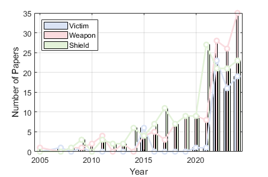
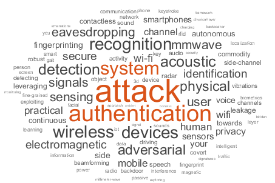

# Awesome Wireless Sensing Security

[](https://awesome.re)

> A curated list of research works on wireless sensing security

## Overview 

This repository provides a comprehensive collection of research exploring the intersection of wireless sensing and security. Works are categorized based on how wireless signals function in security contexts:

🎯 **Victims**
- Research on attacks targeting wireless sensing systems and their defenses

⚔️ **Weapons** 
- Studies exploring wireless signals as attack vectors

🛡️ **Shields**
- Projects leveraging wireless sensing for security applications


---


## Categories

### 1. Wireless Systems as Victims

| Year | Journal/Conference | Title | Relevance Score |
|------|--------------------|-------|-----------------|
| 2024 | NDSS | MadRadar: A Black-Box Physical Layer Attack Framework on mmWave Automotive FMCW Radars | 4 |
| 2024 | TDSC | Time to Think the Security of WiFi-Based Behavior Recognition Systems | 3 |
| 2024 | TMC | SecureSense: Defending Adversarial Attack for Secure Device-Free Human Activity Recognition | 3 |
| 2024 | Security | A First Physical-World Trajectory Prediction Attack via LiDAR-induced Deceptions in Autonomous Driving | 2 |
| 2024 | Security | AE-Morpher: Improve Physical Robustness of Adversarial Objects against LiDAR-based Detectors via Object Reconstruction | 2 |
| 2024 | Security | Adversary is on the Road: Attacks on Visual SLAM using Unnoticeable Adversarial Patch | 2 |
| 2024 | Security | pi-Jack: Physical-World Adversarial Attack on Monocular Depth Estimation with Perspective Hijacking | 2 |
| 2024 | Mobicom | Malicious Attacks against Multi-Sensor Fusion in Autonomous Driving | 2 |
| 2024 | TIFS | Adversarial Examples Against WiFi Fingerprint-Based Localization in the Physical World | 2 |
| 2024 | TIFS | Imperceptible and Robust Backdoor Attack in 3D Point Cloud | 2 |
| 2024 | TIFS | PHY-Layer Authentication Exploiting Channel Sparsity in MmWave MIMO UAV-Ground Systems | 2 |
| 2024 | TIFS | Reconfigurable Intelligent Surface-Assisted Key Generation for Millimeter-Wave Multi-User Systems | 2 |
| 2024 | TIFS | iBA: Backdoor Attack on 3D Point Cloud via Reconstructing Itself. | 2 |
| 2024 | TMC | Interference-Negligible Privacy-Preserved Shield for RF Sensing | 2 |
| 2024 | Infocom | Explanation-Guided Backdoor Attacks on Model-Agnostic RF Fingerprinting | 2 |
| 2024 | NDSS | Invisible Reflections: Leveraging Infrared Laser Reflections to Target Traffic Sign Perception | 1 |
| 2024 | Mobisys | F2Key: Dynamically Converting Your Face into a Private Key Based on COTS Headphones for Reliable Voice Interaction | 1 |
| 2024 | Mobisys | Invisible Optical Adversarial Stripes on Traffic Sign against Autonomous Vehicles | 1 |
| 2024 | TIFS | Reconfigurable Intelligent Surface-Assisted Passive Beamforming Attack | 1 |
| 2024 | TIFS | Stealthy and Effective Physical Adversarial Attacks in Autonomous Driving | 1 |
| 2024 | TMC | PhyFinAtt: An Undetectable Attack Framework Against PHY Layer Fingerprint-Based WiFi Authentication | 1 |
| 2024 | TMC | UAV-Enabled Secure Communications via Collaborative Beamforming With Imperfect Eavesdropper Information | 1 |
| 2023 | S&P | mmSpoof: Resilient Spoofing of Automotive Millimeter-wave Radars using Reflect Array | 4 |
| 2023 | NDSS | MetaWave: Attacking mmWave Sensing with Meta-material-enhanced Tags | 4 |
| 2023 | CCS | TileMask: A Passive-Reflection-based Attack against mmWave Radar Object Detection in Autonomous Driving | 4 |
| 2023 | Security | X-Adv: Physical Adversarial Object Attacks against X-ray Prohibited Item Detection | 3 |
| 2023 | Sensys | RIStealth: Practical and Covert Physical-Layer Attack against WiFi-based Intrusion Detection via Reconfigurable Intelligent Surface | 3 |
| 2023 | Infocom | Secur-Fi: A Secure Wireless Sensing System Based on Commercial Wi-Fi Devices | 3 |
| 2023 | Infocom | Universal Targeted Adversarial Attacks Against mmWave-based Human Activity Recognition | 3 |
| 2023 | S&P | PLA-LiDAR: Physical Laser Attacks against LiDAR-based 3D Object Detection in Autonomous Vehicle | 2 |
| 2023 | Security | Exorcising "Wraith": Protecting LiDAR-based Object Detector in Automated Driving System from Appearing Attacks | 2 |
| 2023 | Security | You Can't See Me: Physical Removal Attacks on LiDAR-based Autonomous Vehicles Driving Frameworks | 2 |
| 2023 | TIFS | Exploiting Fine-Grained Channel/Hardware Features for PHY-Layer Authentication in MmWave MIMO Systems | 2 |
| 2023 | TIFS | Robust Multi-Beam Secure mmWave Wireless Communication for Hybrid Wiretapping Systems | 2 |
| 2023 | TIFS | The Art of Defense: Letting Networks Fool the Attacker | 2 |
| 2023 | S&P | Breaking Security-Critical Voice Authentication | 1 |
| 2023 | TIFS | A Defensive Strategy Against Beam Training Attack in 5G mmWave Networks for Manufacturing | 1 |
| 2023 | TMC | Pilot Spoofing Attack Detection and Localization With Mobile Eavesdropper | 1 |
| 2023 | Infocom | Oblivion: Poisoning Federated Learning by Inducing Catastrophic Forgetting | 1 |
| 2022 | Mobisys | Universal targeted attacks against mmWave-based human activity recognition system | 4 |
| 2022 | Sigcomm | RF-protect: privacy against device-free human tracking | 4 |
| 2022 | IMWUT | WiAdv: Practical and Robust Adversarial Attack against WiFi-based Gesture Recognition System | 4 |
| 2022 | Security | Security Analysis of Camera-LiDAR Fusion Against Black-Box Attacks on Autonomous Vehicles | 3 |
| 2022 | TDSC | IS-WARS: Intelligent and Stealthy Adversarial Attack to Wi-Fi-Based Human Activity Recognition Systems | 3 |
| 2022 | Infocom | Physical-World Attack towards WiFi-based Behavior Recognition | 3 |
| 2022 | Mobicom | Protego: securing wireless communication via programmable metasurface | 2 |
| 2022 | Mobisys | Defending wi-fi network discovery from time correlation tracking | 2 |
| 2022 | Sensys | Towards Backdoor Attacks against LiDAR Object Detection in Autonomous Driving | 2 |
| 2022 | TIFS | A Practical Deceptive Jamming Method Based on Vulnerable Location Awareness Adversarial Attack for Radar HRRP Target Recognition | 2 |
| 2022 | CCS | Physical Hijacking Attacks against Object Trackers | 2 |
| 2022 | Security | DoubleStar: Long-Range Attack Towards Depth Estimation based Obstacle Avoidance in Autonomous Systems | 1 |
| 2022 | Security | Ghost Peak: Practical Distance Reduction Attacks Against HRP UWB Ranging | 1 |
| 2022 | Security | Who Are You (I Really Wanna Know)? Detecting Audio {DeepFakes} Through Vocal Tract Reconstruction | 1 |
| 2022 | NDSS | Fooling the Eyes of Autonomous Vehicles: Robust Physical Adversarial Examples Against Traffic Sign Recognition Systems | 1 |
| 2022 | Mobicom | Audio-domain position-independent backdoor attack via unnoticeable triggers | 1 |
| 2022 | Sensys | KITE: Exploring the Practical Threat from Acoustic Transduction Attacks on Inertial Sensors | 1 |
| 2022 | TIFS | Beyond the Pixel World: A Novel Acoustic-Based Face Anti-Spoofing System for Smartphones | 1 |
| 2022 | TIFS | Fine-Grained Question-Level Deception Detection via Graph-Based Learning and Cross-Modal Fusion | 1 |
| 2022 | TIFS | Robust Secure Beamforming for Intelligent Reflecting Surface Assisted Full-Duplex MISO Systems | 1 |
| 2022 | TIFS | Secure Millimeter-Wave Ad Hoc Communications Using Physical Layer Security | 1 |
| 2022 | Infocom | Backdoor Defense with Machine Unlearning | 1 |
| 2022 | Infocom | Fast and Secure Key Generation with Channel Obfuscation in Slowly Varying Environments | 1 |
| 2022 | CCS | FenceSitter: Black-box, Content-Agnostic, and Synchronization-Free Enrollment-Phase Attacks on Speaker Recognition Systems | 1 |
| 2022 | CCS | SSLGuard: A Watermarking Scheme for Self-supervised Learning Pre-trained Encoders | 1 |
| 2021 | NDSS | EarArray: Defending against DolphinAttack via Acoustic Attenuation | 2 |
| 2021 | CCS | CapSpeaker: Injecting Voices to Microphones via Capacitors | 2 |
| 2021 | S&P | Who is Real Bob? Adversarial Attacks on Speaker Recognition Systems | 1 |
| 2021 | Security | Fragment and Forge: Breaking {Wi-Fi} Through Frame Aggregation and Fragmentation | 1 |
| 2021 | Security | Too Good to Be Safe: Tricking Lane Detection in Autonomous Driving with Crafted Perturbations | 1 |
| 2021 | Sensys | Adversarial Attacks against LiDAR Semantic Segmentation in Autonomous Driving | 1 |
| 2021 | CCS | Can We Use Arbitrary Objects to Attack LiDAR Perception in Autonomous Driving? | 1 |
| 2021 | Infocom | Jamming of LoRa PHY and Countermeasure | 1 |
| 2020 | NDSS | Metamorph: Injecting Inaudible Commands into Over-the-air Voice Controlled Systems | 1 |
| 2020 | USENIX Security | Towards Robust LiDAR-based Perception in Autonomous Driving: General Black-box Adversarial Sensor Attack and Countermeasures | 1 |
| 2020 | USENIX Security | {Devil¡¯s} Whisper: A General Approach for Physical Adversarial Attacks against Commercial Black-box Speech Recognition Devices | 1 |
| 2019 | NDSS | Adversarial Attacks Against Automatic Speech Recognition Systems via Psychoacoustic Hiding | 1 |
| 2019 | CCS | Adversarial Sensor Attack on LiDAR-based Perception in Autonomous Driving | 1 |

### 2. Wireless Signals as Attack Tools

Papers exploring how wireless signals can be weaponized for attacks.

| Year | Journal/Conference | Title | Relevance Score |
|------|--------------------|-------|-----------------|
| 2024 | Mobicom | Practical Adversarial Attack on WiFi Sensing Through Unnoticeable Communication Packet Perturbation | 3 |
| 2024 | TMC | Towards Unconstrained Vocabulary Eavesdropping With mmWave Radar Using GAN | 3 |
| 2024 | Infocom | mmEar: Push the Limit of COTS mmWave Eavesdropping on Headphones | 3 |
| 2024 | Security | AE-Morpher: Improve Physical Robustness of Adversarial Objects against LiDAR-based Detectors via Object Reconstruction | 2 |
| 2024 | Mobicom | Beamforming made Malicious: Manipulating Wi-Fi Traffic via Beamforming Feedback Forgery | 2 |
| 2024 | TDSC | Air-Gap Electromagnetic Covert Channel | 2 |
| 2024 | TDSC | Practical EMI Attacks on Smartphones With Users¡¯ Commands Cancelled | 2 |
| 2024 | TDSC | Privacy Leakage in Wireless Charging | 2 |
| 2024 | TMC | Echoes of Fingertip: Unveiling POS Terminal Passwords Through Wi-Fi Beamforming Feedback | 2 |
| 2024 | TMC | Exploring Practical Acoustic Transduction Attacks on Inertial Sensors in MDOF Systems | 2 |
| 2024 | TMC | MagView++: Data Exfiltration via CPU Magnetic Signals Under Video Decoding | 2 |
| 2024 | TMC | MuKI-Fi: Multi-Person Keystroke Inference With BFI-Enabled Wi-Fi Sensing | 2 |
| 2024 | TMC | WiFiLeaks: Exposing Stationary Human Presence Through a Wall With Commodity Mobile Devices | 2 |
| 2024 | Infocom | Silent Thief: Password Eavesdropping Leveraging Wi-Fi Beamforming Feedback from POS Terminal | 2 |
| 2024 | Security | Devil in the Room: Triggering Audio Backdoors in the Physical World | 1 |
| 2024 | Security | Eye of Sauron: Long-Range Hidden Spy Camera Detection and Positioning with Inbuilt Memory EM Radiation | 1 |
| 2024 | Security | LaserAdv: Laser Adversarial Attacks on Speech Recognition Systems | 1 |
| 2024 | Security | VibSpeech: Exploring Practical Wideband Eavesdropping via Bandlimited Signal of Vibration-based Side Channel | 1 |
| 2024 | NDSS | Acoustic Keystroke Leakage on Smart Televisions | 1 |
| 2024 | NDSS | CamPro: Camera-based Anti-Facial Recognition | 1 |
| 2024 | NDSS | EM Eye: Characterizing Electromagnetic Side-channel Eavesdropping on Embedded Cameras | 1 |
| 2024 | NDSS | GhostType: The Limits of Using Contactless Electromagnetic Interference to Inject Phantom Keys into Analog Circuits of Keyboards | 1 |
| 2024 | NDSS | LiDAR Spoofing Meets the New-Gen: Capability Improvements, Broken Assumptions, and New Attack Strategies | 1 |
| 2024 | NDSS | PrintListener: Uncovering the Vulnerability of Fingerprint Authentication via the Finger Friction Sound | 1 |
| 2024 | Mobicom | EVLeSen: In-Vehicle Sensing with EV-Leaked Signal | 1 |
| 2024 | Mobicom | Inaudible Backdoor Attack via Stealthy Frequency Trigger Injection in Audio Spectrogram | 1 |
| 2024 | Mobisys | Your Mic Leaks Too Much: A Double-Edged Sword for Security | 1 |
| 2024 | TDSC | Analyzing and Defending GhostTouch Attack Against Capacitive Touchscreens | 1 |
| 2024 | TDSC | UniAP: Protecting Speech Privacy With Non-Targeted Universal Adversarial Perturbations | 1 |
| 2024 | TDSC | Watch Out Your Thumb Drive: Covert Data Theft From Portable Data Storage via Backscatter | 1 |
| 2024 | Infocom | EchoLight: Sound Eavesdropping based on Ambient Light Reflection | 1 |
| 2024 | IMWUT | PPG-Hear: A Practical Eavesdropping Attack with Photoplethysmography Sensors | 1 |
| 2024 | IMWUT | PuppetMouse: Practical and Contactless Mouse Manipulation Attack via Intentional Electromagnetic Interference Injection | 1 |
| 2024 | Infocom | RF-Parrot: Wireless Eavesdropping on Wired Audio | 1 |
| 2024 | Infocom | Two-Way Aerial Secure Communications via Distributed Collaborative Beamforming under Eavesdropper Collusion | 1 |
| 2023 | S&P | mmEcho: A mmWave-based Acoustic Eavesdropping Method | 3 |
| 2023 | TMC | Keystroke Recognition With the Tapping Sound Recorded by Mobile Phone Microphones | 3 |
| 2023 | TMC | Measuring Micrometer-Level Vibrations With mmWave Radar | 3 |
| 2023 | CCS | Privacy Leakage via Speech-induced Vibrations on Room Objects through Remote Sensing based on Phased-MIMO | 3 |
| 2023 | Infocom | mmEavesdropper: Signal Augmentation-based Directional Eavesdropping with mmWave Radar | 3 |
| 2023 | Infocom | mmMIC: Multi-modal Speech Recognition based on mmWave Radar | 3 |
| 2023 | NDSS | Paralyzing Drones via EMI Signal Injection on Sensory Communication Channels | 2 |
| 2023 | TMC | No Seeing is Also Believing: Electromagnetic-Emission-Based Application Guessing Attacks via Smartphones | 2 |
| 2023 | TMC | No Seeing is Also Believing: Electromagnetic-Emission-Based Application Guessing Attacks via Smartphones | 2 |
| 2023 | CCS | FaceReader: Unobtrusively Mining Vital Signs and Vital Sign Embedded Sensitive Info via AR/VR Motion Sensors | 2 |
| 2023 | IMWUT | IoTBeholder: A Privacy Snooping Attack on User Habitual Behaviors from Smart Home Wi-Fi Traffic | 2 |
| 2023 | IMWUT | RF-Mic: Live Voice Eavesdropping via Capturing Subtle Facial Speech Dynamics Leveraging RFID | 2 |
| 2023 | S&P | Private Eye: On the Limits of Textual Screen Peeking via Eyeglass Reflections in Video Conferencing | 1 |
| 2023 | S&P | Side Eye: Characterizing the Limits of POV Acoustic Eavesdropping from Smartphone Cameras with Rolling Shutters and Movable Lenses | 1 |
| 2023 | NDSS | Brokenwire: Wireless Disruption of CCS Electric Vehicle Charging | 1 |
| 2023 | Mobicom | Exploiting Contactless Side Channels in Wireless Charging Power Banks for User Privacy Inference via Few-shot Learning | 1 |
| 2023 | Mobicom | MagTracer: Detecting GPU Cryptojacking Attacks via Magnetic Leakage Signals | 1 |
| 2023 | Mobicom | Screen Perturbation: Adversarial Attack and Defense on Under-Screen Camera | 1 |
| 2023 | Mobisys | BystandAR: Protecting Bystander Visual Data in Augmented Reality Systems | 1 |
| 2023 | Mobisys | EchoAttack: Practical Inaudible Attacks To Smart Earbuds | 1 |
| 2023 | TMC | Borrowing Arrows With Thatched Boats: Exploiting the Reactive Primary Communications for Boosting Jamming-Assisted Proactive Eavesdropping | 1 |
| 2023 | Infocom | Expelliarmus: Command Cancellation Attacks on Smartphones using Electromagnetic Interference | 1 |
| 2023 | Infocom | MagFingerprint: A Magnetic Based Device Fingerprinting in Wireless Charging | 1 |
| 2023 | IMWUT | Privacy against Real-Time Speech Emotion Detection via Acoustic Adversarial Evasion of Machine Learning | 1 |
| 2023 | CCS | Recovering Fingerprints from In-Display Fingerprint Sensors via Electromagnetic Side Channel | 1 |
| 2023 | IMWUT | VoiceListener: A Training-free and Universal Eavesdropping Attack on Built-in Speakers of Mobile Devices | 1 |
| 2022 | NDSS | SpiralSpy: Exploring a Stealthy and Practical Covert Channel to Attack Air-gapped Computing Devices via mmWave Sensing | 4 |
| 2022 | Mobicom | mmEve: eavesdropping on smartphone's earpiece via COTS mmWave device | 4 |
| 2022 | Infocom | MILLIEAR: Millimeter-wave Acoustic Eavesdropping with Unconstrained Vocabulary | 4 |
| 2022 | SP | mmSpy: Spying Phone Calls using mmWave Radars | 4 |
| 2022 | Mobisys | Speech privacy attack via vibrations from room objects leveraging a phased-MIMO radar | 3 |
| 2022 | IMWUT | AmbiEar: mmWave Based Voice Recognition in NLoS Scenarios | 3 |
| 2022 | IMWUT | Wavesdropper: Through-wall Word Detection of Human Speech via Commercial mmWave Devices | 3 |
| 2022 | Infocom | mmPhone: Acoustic Eavesdropping on Loudspeakers via mmWave-characterized Piezoelectric Effect | 3 |
| 2022 | Mobicom | Non-cooperative wi-fi localization & its privacy implications | 2 |
| 2022 | Mobisys | MagEar: eavesdropping via audio recovery using magnetic side channel | 2 |
| 2022 | TIFS | Secure Active and Passive Beamforming in IRS-Aided MIMO Systems | 2 |
| 2022 | TMC | Securing IoT Devices by Exploiting Backscatter Propagation Signatures | 2 |
| 2022 | SP | Graphics Peeping Unit: Exploiting EM Side-Channel Information of GPUs to Eavesdrop on Your Neighbors | 2 |
| 2022 | SP | IRShield: A Countermeasure Against Adversarial Physical-Layer Wireless Sensing | 2 |
| 2022 | CCS | TickTock: Detecting Microphone Status in Laptops Leveraging Electromagnetic Leakage of Clock Signals | 2 |
| 2022 | Security | Can one hear the shape of a neural network?: Snooping the GPU via Magnetic Side Channel | 1 |
| 2022 | Security | Lamphone: Passive Sound Recovery from a Desk Lamp's Light Bulb Vibrations | 1 |
| 2022 | Security | Lend Me Your Ear: Passive Remote Physical Side Channels on PCs | 1 |
| 2022 | Sensys | Light Auditor: Power Measurement Can Tell Private Data Leakage through IoT Covert Channels | 1 |
| 2022 | Sensys | Push the Limit of Adversarial Example Attack on Speaker Recognition in Physical Domain | 1 |
| 2022 | TIFS | Invisible Geolocation Signature Extraction From a Single Image | 1 |
| 2022 | TIFS | Multi-User Beam Training and Transmission Design for Covert Millimeter-Wave Communication | 1 |
| 2022 | TIFS | Secure Multiantenna Transmission With an Unknown Eavesdropper: Power Allocation and Secrecy Outage Analysis | 1 |
| 2022 | TMC | Preventing Sensitive Information Leakage From Mobile Sensor Signals via Integrative Transformation | 1 |
| 2022 | TMC | Secure Voice Input on Augmented Reality Headsets | 1 |
| 2022 | SP | Attacks on Wireless Coexistence: Exploiting Cross-Technology Performance Features for Inter-Chip Privilege Escalation | 1 |
| 2022 | CCS | HeatDeCam: Detecting Hidden Spy Cameras via Thermal Emissions | 1 |
| 2022 | SP | Invisible Finger: Practical Electromagnetic Interference Attack on Touchscreen-based Electronic Devices | 1 |
| 2021 | IMWUT | Thru-the-wall Eavesdropping on Loudspeakers via RFID by Capturing Sub-mm Level Vibration | 3 |
| 2021 | S&P | Poltergeist: Acoustic Adversarial Machine Learning against Cameras and Computer Vision | 2 |
| 2021 | S&P | When LoRa Meets EMR: Electromagnetic Covert Channels Can Be Super Resilient | 2 |
| 2021 | NDSS | Screen Gleaning: A Screen Reading TEMPEST Attack on Mobile Devices Exploiting an Electromagnetic Side Channel | 2 |
| 2021 | IMWUT | My(o) Armband Leaks Passwords: An EMG and IMU Based Keylogging Side-Channel Attack | 2 |
| 2021 | CCS | Periscope: A Keystroke Inference Attack Using Human Coupled Electromagnetic Emanations | 2 |
| 2021 | CCS | Wireless Charging Power Side-Channel Attacks | 2 |
| 2020 | S&P | C3APSULe: Cross-FPGA Covert-Channel Attacks through Power Supply Unit Leakage | 2 |
| 2020 | S&P | Detection of Electromagnetic Interference Attacks on Sensor Systems | 2 |
| 2020 | S&P | WaveSpy: Remote and Through-wall Screen Attack via mmWave Sensing | 2 |
| 2020 | NDSS | Et Tu Alexa? When Commodity WiFi Devices Turn into Adversarial Motion Sensors | 2 |
| 2020 | NDSS | SurfingAttack: Interactive Hidden Attack on Voice Assistants Using Ultrasonic Guided Waves | 2 |
| 2019 | S&P | Hard Drive of Hearing: Disks that Eavesdrop with a Synthesized Microphone | 2 |
| 2019 | S&P | Synesthesia: Detecting Screen Content via Remote Acoustic Side Channels | 2 |
| 2019 | S&P | Tap 'n Ghost: A Compilation of Novel Attack Techniques against Smartphone Touchscreens | 2 |
| 2019 | NDSS | RFDIDS: Radio Frequency-based Distributed Intrusion Detection System for the Power Grid | 2 |
| 2019 | USENIX Security | CSI NN: Reverse Engineering of Neural Network Architectures Through Electromagnetic Side Channel | 2 |
| 2019 | USENIX Security | Losing the Car Keys: Wireless PHY-Layer Insecurity in EV Charging | 2 |
| 2019 | USENIX Security | Wireless Attacks on Aircraft Instrument Landing Systems | 2 |
| 2019 | CCS | Latent Backdoor Attacks on Deep Neural Networks | 1 |
| 2019 | CCS | Seeing isn't Believing: Towards More Robust Adversarial Attack Against Real World Object Detectors | 1 |

### 3. Wireless Signals as Security Guardians

Papers on using wireless signals for security applications.

| Year | Journal/Conference | Title | Relevance Score |
|------|--------------------|-------|-----------------|
| 2024 | IMWUT | RDGait: A mmWave Based Gait User Recognition System for Complex Indoor Environments Using Single-chip Radar | 3 |
| 2024 | S&P | Guessing on Dominant Paths: Understanding the Limitation of Wireless Authentication Using Channel State Information | 2 |
| 2024 | Security | Lumos: Identifying and Localizing Diverse Hidden IoT Devices in an Unfamiliar Environment | 2 |
| 2024 | TIFS | DCS-Gait: A Class-Level Domain Adaptation Approach for Cross-Scene and Cross-State Gait Recognition Using Wi-Fi CSI | 2 |
| 2024 | TIFS | Dr. Defender: Proactive Detection of Autopilot Drones Based on CSI. | 2 |
| 2024 | TDSC | BIOWISH: Biometric Recognition Using Wearable Inertial Sensors Detecting Heart Activity | 2 |
| 2024 | TMC | CovertEye: Gait-Based Human Identification Under Weakly Constrained Trajectory | 2 |
| 2024 | TMC | MAUTH: Continuous User Authentication Based on Subtle Intrinsic Muscular Tremors | 2 |
| 2024 | TMC | MagSign: Harnessing Dynamic Magnetism for User Authentication on IoT Devices | 2 |
| 2024 | TMC | Sensing Human Gait for Environment-Independent User Authentication Using Commodity RFID Devices | 2 |
| 2024 | TMC | Touchscreens Can Reveal User Identity: Capacitive Plethysmogram-Based Biometrics | 2 |
| 2024 | TMC | Towards Receiver-Agnostic and Collaborative Radio Frequency Fingerprint Identification | 2 |
| 2024 | TMC | Turning Noises to Fingerprint-Free ¡°Credentials¡±: Secure and Usable Drone Authentication | 2 |
| 2024 | TMC | Two-Factor Authentication for Keyless Entry System via Finger-Induced Vibrations | 2 |
| 2024 | TMC | Unsupervised Sensor-Based Continuous Authentication With Low-Rank Transformer Using Learning-to-Rank Algorithms | 2 |
| 2024 | TMC | ZITA: Zero-Interaction Two-Factor Authentication Using Contact Traces and In-Band Proximity Verification | 2 |
| 2024 | Infocom | AGR: Acoustic Gait Recognition Using Interpretable Micro-Range Profile | 2 |
| 2024 | Mobisys | Face Recognition In Harsh Conditions: An Acoustic Based Approach | 1 |
| 2024 | TIFS | Dual-Adversarial Representation Disentanglement for Visible Infrared Person Re-Identification | 1 |
| 2024 | TIFS | RFTrack: Stealthy Location Inference and Tracking Attack on Wi-Fi Devices | 1 |
| 2024 | TDSC | CyberSpec: Behavioral Fingerprinting for Intelligent Attacks Detection on Crowdsensing Spectrum Sensors | 1 |
| 2024 | TDSC | MotoPrint: Reconfigurable Vibration Motor Fingerprint via Homologous Signals Learning | 1 |
| 2024 | TDSC | User Authentication on Earable Devices via Bone-Conducted Occlusion Sounds | 1 |
| 2023 | TIFS | Radar2: Passive Spy Radar Detection and Localization Using COTS mmWave Radar | 4 |
| 2023 | Security | Person Re-identification in 3D Space: A WiFi Vision-based Approach | 3 |
| 2023 | S&P | Guessing on Dominant Paths: Understanding the Limitation of Wireless Authentication Using Channel State Information | 2 |
| 2023 | S&P | ImU: Physical Impersonating Attack for Face Recognition System with Natural Style Changes | 2 |
| 2023 | S&P | Low-effort VR Headset User Authentication Using Head-reverberated Sounds with Replay Resistance | 2 |
| 2023 | NDSS | SoundLock: A Novel User Authentication Scheme for VR Devices Using Auditory-Pupillary Response | 2 |
| 2023 | Sensys | Jawthenticate: Microphone-free Speech-based Authentication using Jaw Motion and Facial Vibrations | 2 |
| 2023 | TDSC | PressPIN: Enabling Secure PIN Authentication on Mobile Devices via Structure-Borne Sounds | 2 |
| 2023 | TMC | H2K: A Heartbeat-Based Key Generation Framework for ECG and PPG Signals | 2 |
| 2023 | TMC | RF-Badge: Vital Sign-Based Authentication via RFID Tag Array on Badges | 2 |
| 2023 | TMC | Sweep-to-Unlock: Fingerprinting Smartphones Based on Loudspeaker Roll-Off Characteristics | 2 |
| 2023 | TMC | VocalPrint: A mmWave-Based Unmediated Vocal Sensing System for Secure Authentication | 2 |
| 2023 | IMWUT | NF-Heart: A Near-field Non-contact Continuous User Authentication System via Ballistocardiogram | 2 |
| 2023 | Infocom | Nowhere to Hide: Detecting Live Video Forgery via Vision-WiFi Silhouette Correspondence | 2 |
| 2023 | Mobisys | BioCase: Privacy Protection via Acoustic Sensing of Finger Touches on Smartphone Case Mini-Structures | 1 |
| 2023 | TIFS | Occlusion-Aware Human Mesh Model-Based Gait Recognition | 1 |
| 2023 | TIFS | Self-Supervised Modality-Aware Multiple Granularity Pre-Training for RGB-Infrared Person Re-Identification | 1 |
| 2023 | TMC | Secure User Verification and Continuous Authentication via Earphone IMU | 1 |
| 2023 | Infocom | BreathSign: Transparent and Continuous In-ear Authentication Using Bone-conducted Breathing Biometrics | 1 |
| 2023 | IMWUT | Fingerprinting IoT Devices Using Latent Physical Side-Channels | 1 |
| 2023 | Infocom | SkyNet: Multi-Drone Cooperation for Real-Time Person Identification and Localization | 1 |
| 2022 | TIFS | Person Re-Identification Through Wi-Fi Extracted Radio Biometric Signatures | 3 |
| 2022 | IMWUT | RFCam: Uncertainty-aware Fusion of Camera and Wi-Fi for Real-time Human Identification with Mobile Devices | 3 |
| 2022 | Sensys | Accuth: Anti-Spoofing Voice Authentication via Accelerometer | 2 |
| 2022 | TDSC | Toward Robust Detection of Puppet Attacks via Characterizing Fingertip-Touch Behaviors | 2 |
| 2022 | TMC | Attention-Based Gait Recognition and Walking Direction Estimation in Wi-Fi Networks | 2 |
| 2022 | TMC | Enabling Finger-Touch-Based Mobile User Authentication via Physical Vibrations on IoT Devices | 2 |
| 2022 | TMC | Health-Radio: Towards Contactless Myocardial Infarction Detection Using Radio Signals | 2 |
| 2022 | TMC | Radio Frequency Fingerprinting on the Edge | 2 |
| 2022 | TMC | Robust Human Face Authentication Leveraging Acoustic Sensing on Smartphones | 2 |
| 2022 | TMC | Scanning the Voice of Your Fingerprint With Everyday Surfaces | 2 |
| 2022 | TMC | Wi-PIGR: Path Independent Gait Recognition With Commodity Wi-Fi | 2 |
| 2022 | TMC | WiFace: Facial Expression Recognition Using Wi-Fi Signals | 2 |
| 2022 | TMC | WiHF: Gesture and User Recognition With WiFi | 2 |
| 2022 | CCS | EchoHand: High Accuracy and Presentation Attack Resistant Hand Authentication on Commodity Mobile Devices | 2 |
| 2022 | Infocom | Push the Limit of WiFi-based User Authentication towards Undefined Gestures | 2 |
| 2022 | Mobisys | Your tapstroke tells who you are: authenticating smartphone users with tapstroke-driven vibrations | 1 |
| 2022 | TIFS | BCAuth: Physical Layer Enhanced Authentication and Attack Tracing for Backscatter Communications | 1 |
| 2022 | TMC | Multi-Agent Coordinated Close-in Jamming for Disabling a Rogue Drone | 1 |
| 2022 | TMC | Simultaneous Energy Harvesting and Gait Recognition Using Piezoelectric Energy Harvester | 1 |
| 2022 | IMWUT | AEROKEY: Using Ambient Electromagnetic Radiation for Secure and Usable Wireless Device Authentication | 1 |
| 2022 | CCS | Poster: A WiFi Vision-based Approach to Person Re-identification | 1 |
| 2021 | Security | I Always Feel Like Somebody's Sensing Me! A Framework to Detect, Identify, and Localize Clandestine Wireless Sensors | 2 |
| 2021 | Mobicom | BioFace-3D: continuous 3d facial reconstruction through lightweight single-ear biosensors | 2 |
| 2021 | Mobicom | EarGate: gait-based user identification with in-ear microphones | 2 |
| 2021 | Mobisys | Counting a stationary crowd using off-the-shelf wifi | 2 |
| 2021 | IMWUT | ChestLive: Fortifying Voice-based Authentication with Chest Motion Biometric on Smart Devices | 2 |
| 2021 | IMWUT | DriverSonar: Fine-Grained Dangerous Driving Detection Using Active Sonar | 2 |
| 2021 | IMWUT | DronePrint: Acoustic Signatures for Open-set Drone Detection and Identification with Online Data | 2 |
| 2021 | IMWUT | Leakage or Identification: Behavior-irrelevant User Identification Leveraging Leakage Current on Laptops | 2 |
| 2021 | Infocom | Physical Layer Key Generation between Backscatter Devices over Ambient RF Signals | 2 |
| 2021 | Infocom | Proximity-Echo: Secure Two Factor Authentication Using Active Sound Sensing | 2 |
| 2021 | IMWUT | RF-Identity: Non-Intrusive Person Identification Based on Commodity RFID Devices | 2 |
| 2021 | Infocom | RFace: Anti-Spoofing Facial Authentication Using COTS RFID | 2 |
| 2021 | IMWUT | RFaceID: Towards RFID-based Facial Recognition | 2 |
| 2021 | CCS | Revisiting Fuzzy Signatures: Towards a More Risk-Free Cryptographic Authentication System based on Biometrics | 2 |
| 2021 | IMWUT | Unobtrusive Pedestrian Identification by Leveraging Footstep Sounds with Replay Resistance | 2 |
| 2021 | IMWUT | Voice In Ear: Spoofing-Resistant and Passphrase-Independent Body Sound Authentication | 2 |
| 2021 | IMWUT | WiStress: Contactless Stress Monitoring Using Wireless Signals | 2 |
| 2021 | Mobicom | Face-Mic: inferring live speech and speaker identity via subtle facial dynamics captured by AR/VR motion sensors | 1 |
| 2021 | Mobicom | Notification privacy protection via unobtrusive gripping hand verification using media sounds | 1 |
| 2021 | Mobisys | MotionCompass: pinpointing wireless camera via motion-activated traffic | 1 |
| 2021 | Sensys | Wavoice: A Noise-resistant Multi-modal Speech Recognition System Fusing mmWave and Audio Signals | 1 |
| 2021 | CCS | Biometrics-Authenticated Key Exchange for Secure Messaging | 1 |
| 2020 | S&P | Leveraging EM Side-Channel Information to Detect Rowhammer Attacks | 2 |
| 2020 | NDSS | Hold the Door! Fingerprinting Your Car Key to Prevent Keyless Entry Car Theft | 2 |
| 2020 | USENIX Security | You Are What You Broadcast: Identification of Mobile and IoT Devices from (Public) WiFi | 2 |
| 2020 | CCS | Game-Set-MATCH: Using Mobile Devices for Seamless External-Facing Biometric Matching | 1 |
| 2020 | USENIX Security | Liveness is Not Enough: Enhancing Fingerprint Authentication with Behavioral Biometrics to Defeat Puppet Attacks | 1 |
| 2019 | Mobicom | XModal-ID: Using WiFi for Through-Wall Person Identification from Candidate Video Footage | 2 |
| 2019 | CCS | DeMiCPU: Device Fingerprinting with Magnetic Signals Radiated by CPU | 2 |


## Visualization and Analysis


We provide both the raw data (CSV format) and visualization code for reproducing the analysis figures in our survey paper.




- Navigate to the analysis directory:

```
cd analysis
```

- Run the MATLAB script:

```matlab
analysis.m
```



## Updates & Contact

This is a continuously maintained collection of wireless sensing security research. Welcome expand this list by:
- Opening an issue or pull request
- Sending suggestions via email


---

## Citation

If you find this repository useful, please consider citing:
```bibtex
@article{WirelessSensingSecurity2024,
  title={A Comprehensive Survey on Wireless Sensing Security: A Role-based Perspective},
  author={Ruixu Geng*, Jianyang Wang*, Yuqin Yuan, Fengquan Zhan, Tianyu Zhang, Rui Zhang, Pengcheng Huang, Dongheng Zhang, Jinbo Chen, Yang Hu, Yan Chen},
  journal={arxiv},
  year={2024}
}
```